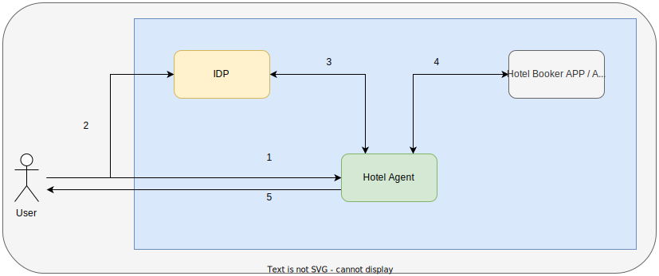
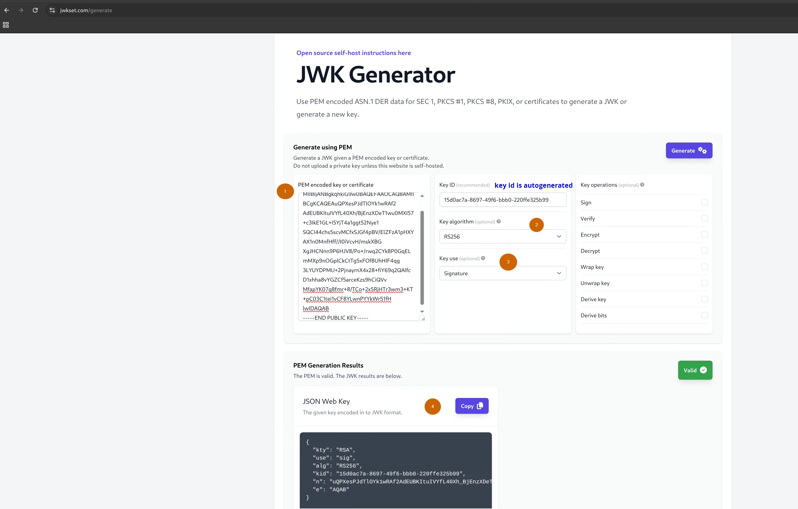
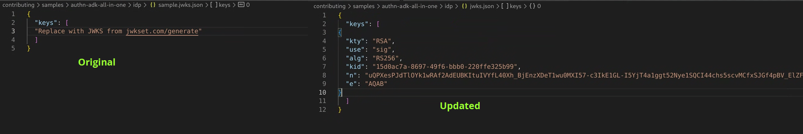

## ADK Authentication Demo (All in one - Agent, IDP and The app)

This folder contains everything you need to run the ADK's `auth-code`
 grant type authentication demo completely locally

Here's the high level diagram.



### Introduction
More often than not the agents use some kind of system identity
 (especially for OpenAPI and MCP tools).
 But obviously this is insecure in that multiple end users
 are using the same identity with permissions to access ALL users' data on the
 backend.

ADK provides various [authentication mechanisms](https://google.github.io/adk-docs/tools/authentication/) to solve this.

However to properly test it you need various components.
We provide everything that is needed so that you can test and run
 ADK authentication demo locally.

This folder comes with -

1. An IDP
2. A hotel booking application backend
3. A hotel assistant ADK agent (accessing the application using OpenAPI Tools)

### Details

You can read about the Auth Code grant / flow type in detail [here](https://developer.okta.com/blog/2018/04/10/oauth-authorization-code-grant-type). But for the purpose of this demo, following steps take place

1. The user asks the agent to find hotels in "New York".
2. Agent realizes (based on LLM response) that it needs to call a tool and that the tool needs authentication.
3. Agent redirects the user to the IDP's login page with callback / redirect URL back to ADK UI.
4. The user enters credentials (`john.doe` and `password123`) and accepts the consent.
5. The IDP sends the auth_code back to the redirect URL (from 3).
6. ADK then exchanges this auth_code for an access token.
7. ADK does the API call to get details on hotels and hands over that response to LLM, LLM formats the response.
8. ADK sends a response back to the User.

### Setting up and running

1. Clone this repository
2. Carry out following steps and create and activate the environment
```bash
# Go to the cloned directory
cd adk-python
# Navigate to the all in one authentication sample
cd contributing/samples/authn-adk-all-in-one/

python3 -m venv .venv

. .venv/bin/activate

pip install -r requirements.txt

```
3. Configure and Start the IDP. Our IDP needs a private key to sign the tokens and a JWKS with public key component to verify them. Steps are provided for that (please check the screenshots below)

🪧 **NOTE:**
It is recommended that you execute the key pair creation and public
 key extraction commands (1-3 and 5 below) on Google cloud shell.

```bash
cd idp

# Create .env file by copying the existing one.
cp sample.env .env
cp sample.jwks.json jwks.json


# Carry out following steps
# 1. Generate a key pair, When asked about passphrase please press enter (empty passphrase)
ssh-keygen -t rsa -b 2048 -m PEM -f private_key.pem

# 2. Extract the public key
openssl rsa -in private_key.pem -pubout > pubkey.pub

# 3. Generate the jwks.json content using https://jwkset.com/generate and this public key (choose key algorithm RS256 and Key use Signature) (Please check the screenshot)
# 4. Update the jwks.json with the key jwks key created in 3 (please check the screenshot)
# 5. Update the env file with the private key
cat private_key.pem | tr -d "\n"
# 6. Carefully copy output of the command above into the .env file to update the value of PRIVATE_KEY
# 7. save jwks.json and .env

# Start the IDP
python app.py
```
<details>

<summary><b>Screenshots</b></summary>
Generating JWKS -



Updated `jwks.json` (notice the key is added in the existing array)



</details>

4. In a separate shell - Start the backend API (Hotel Booking Application)
```bash
# Go to the cloned directory
cd adk-python
# Navigate to the all in one authentication sample
cd contributing/samples/authn-adk-all-in-one/

# Activate Env for this shell
. .venv/bin/activate

cd hotel_booker_app/

# Start the hotel booker application
python main.py

```

5. In a separate shell - Start the ADK agent
```bash
# Go to the cloned directory
cd adk-python
# Navigate to the all in one authentication sample
cd contributing/samples/authn-adk-all-in-one/

# Activate Env for this shell
. .venv/bin/activate

cd adk_agents/

cp sample.env .env

# ⚠️ Make sure to update the API KEY (GOOGLE_API_KEY) in .env file

# Run the agent
adk web

```
6. Access the agent on http://localhost:8000

🪧 **NOTE:**

After first time authentication,
it might take some time for the agent to respond,
subsequent responses are significantly faster.

### Conclusion

You can exercise the ADK Authentication
without any external components using this demo.

