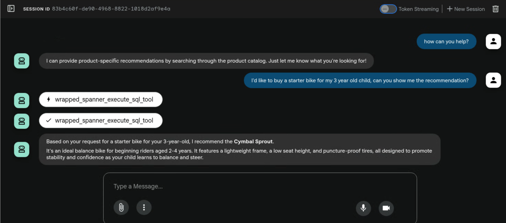

# Spanner Tools RAG Agent Sample

## 🚀 Introduction

This sample demonstrates how to build an intelligent Retrieval Augmented
Generation (RAG) agent using the flexible, built-in Spanner tools available
in the ADK's `google.adk.tools.spanner` module, including how to create
customized Spanner tools by extending the existing ones.

[Spanner](https://cloud.google.com/spanner/docs) is a fully managed,
horizontally scalable, globally distributed database service that is great for
both relational and non-relational operational workloads.
Spanner has built-in vector search support, enabling you to perform similarity
or semantic search and implement retrieval augmented generation (RAG) in GenAI
applications at scale, leveraging either exact K-nearest neighbor (KNN) or
approximate nearest neighbor (ANN) features.
Spanner's vector search queries return fresh real-time data as soon as
transactions are committed, just like any other query on your operational data.

In this sample, you'll build the agent leveraging Spanner's built-in, real-time
vector search capabilities to provide relevant information.

## 🛠️ Setup and Requirements

To run this sample, you need an accessible Spanner instance and database in your
Google Cloud Project.

### Set up the Spanner database table
To set up the schema, navigate to Spanner Studio:
First, you want to add the products table. Copy and paste this statement in the
empty tab.
For the schema, copy and paste this DDL into the box:

```sql
CREATE TABLE products (
  categoryId INT64 NOT NULL,
  productId INT64 NOT NULL,
  productName STRING(MAX) NOT NULL,
  productDescription STRING(MAX) NOT NULL,
  productDescriptionEmbedding ARRAY<FLOAT32>,
  createTime TIMESTAMP NOT NULL OPTIONS (
    allow_commit_timestamp = true
  ),
  inventoryCount INT64 NOT NULL,
  priceInCents INT64,
) PRIMARY KEY(categoryId, productId);
```

Then, click the `run` button and wait a few seconds for your schema to be
created.

### Create an Embedding model
Next, you will create an Embedding model in Spanner and configure it to VertexAI
model endpoint.

```sql
CREATE MODEL EmbeddingsModel INPUT(
content STRING(MAX),
) OUTPUT(
embeddings STRUCT<statistics STRUCT<truncated BOOL, token_count FLOAT32>, values ARRAY<FLOAT32>>,
) REMOTE OPTIONS (
endpoint = '//aiplatform.googleapis.com/projects/<PROJECT_ID>/locations/us-central1/publishers/google/models/text-embedding-004'
);
```

Then, click the `run` button and wait a few seconds for your models to be
created.

Learn more about Spanner `MODEL` in [Spanner Vertex AI integration](https://cloud.google.com/spanner/docs/ml-tutorial-embeddings)

### Load the sample data
Now, you will want to insert some products into your database. Open up a new tab
in Spanner Studio, then copy and paste the following insert statements:

```sql
INSERT INTO products (categoryId, productId, productName, productDescription, createTime, inventoryCount, priceInCents)
VALUES (1, 1, "Cymbal Helios Helmet", "Safety meets style with the Cymbal children's bike helmet. Its lightweight design, superior ventilation, and adjustable fit ensure comfort and protection on every ride. Stay bright and keep your child safe under the sun with Cymbal Helios!", PENDING_COMMIT_TIMESTAMP(), 100, 10999),
(1, 2, "Cymbal Sprout", "Let their cycling journey begin with the Cymbal Sprout, the ideal balance bike for beginning riders ages 2-4 years. Its lightweight frame, low seat height, and puncture-proof tires promote stability and confidence as little ones learn to balance and steer. Watch them sprout into cycling enthusiasts with Cymbal Sprout!", PENDING_COMMIT_TIMESTAMP(), 10, 13999),
(1, 3, "Cymbal Spark Jr.", "Light, vibrant, and ready for adventure, the Spark Jr. is the perfect first bike for young riders (ages 5-8). Its sturdy frame, easy-to-use brakes, and puncture-resistant tires inspire confidence and endless playtime. Let the spark of cycling ignite with Cymbal!", PENDING_COMMIT_TIMESTAMP(), 34, 13900),
(1, 4, "Cymbal Summit", "Conquering trails is a breeze with the Summit mountain bike. Its lightweight aluminum frame, responsive suspension, and powerful disc brakes provide exceptional control and comfort for experienced bikers navigating rocky climbs or shredding downhill. Reach new heights with Cymbal Summit!", PENDING_COMMIT_TIMESTAMP(), 0, 79999),
(1, 5, "Cymbal Breeze", "Cruise in style and embrace effortless pedaling with the Breeze electric bike. Its whisper-quiet motor and long-lasting battery let you conquer hills and distances with ease. Enjoy scenic rides, commutes, or errands with a boost of confidence from Cymbal Breeze!", PENDING_COMMIT_TIMESTAMP(), 72, 129999),
(1, 6, "Cymbal Trailblazer Backpack", "Carry all your essentials in style with the Trailblazer backpack. Its water-resistant material, multiple compartments, and comfortable straps keep your gear organized and accessible, allowing you to focus on the adventure. Blaze new trails with Cymbal Trailblazer!", PENDING_COMMIT_TIMESTAMP(), 24, 7999),
(1, 7, "Cymbal Phoenix Lights", "See and be seen with the Phoenix bike lights. Powerful LEDs and multiple light modes ensure superior visibility, enhancing your safety and enjoyment during day or night rides. Light up your journey with Cymbal Phoenix!", PENDING_COMMIT_TIMESTAMP(), 87, 3999),
(1, 8, "Cymbal Windstar Pump", "Flat tires are no match for the Windstar pump. Its compact design, lightweight construction, and high-pressure capacity make inflating tires quick and effortless. Get back on the road in no time with Cymbal Windstar!", PENDING_COMMIT_TIMESTAMP(), 36, 24999),
(1, 9,"Cymbal Odyssey Multi-Tool","Be prepared for anything with the Odyssey multi-tool. This handy gadget features essential tools like screwdrivers, hex wrenches, and tire levers, keeping you ready for minor repairs and adjustments on the go. Conquer your journey with Cymbal Odyssey!", PENDING_COMMIT_TIMESTAMP(), 52, 999),
(1, 10,"Cymbal Nomad Water Bottle","Stay hydrated on every ride with the Nomad water bottle. Its sleek design, BPA-free construction, and secure lock lid make it the perfect companion for staying refreshed and motivated throughout your adventures. Hydrate and explore with Cymbal Nomad!", PENDING_COMMIT_TIMESTAMP(), 42, 1299);
```

Click the `run` button to insert the data.

### Generate embeddings for the sample data
For similarity search to work on the products, you need to generate embeddings
for the product descriptions.
With the `EmbeddingsModel` created in the schema, this is a simple UPDATE DML
statement to generate embeddings.

```sql
UPDATE products p1
SET productDescriptionEmbedding =
(SELECT embeddings.values from ML.PREDICT(MODEL EmbeddingsModel,
(SELECT productDescription as content FROM products p2 where p2.productId=p1.productId)))
WHERE categoryId=1;
```

Click the `run` button to update the product descriptions.

Learn more about how to [generate and backfill vector embeddings in bulk](https://cloud.google.com/spanner/docs/backfill-embeddings)
for textual data (STRING or JSON) that is stored in Spanner using SQL.

## 🤖 How to use the sample RAG agent built on Spanner

Set up environment variables in your `.env` file for using
[Google AI Studio](https://google.github.io/adk-docs/get-started/quickstart/#gemini---google-ai-studio)
or
[Google Cloud Vertex AI](https://google.github.io/adk-docs/get-started/quickstart/#gemini---google-cloud-vertex-ai)
for the LLM service for your agent. For example, for using Google AI Studio you
would set:

* GOOGLE_GENAI_USE_VERTEXAI=FALSE
* GOOGLE_API_KEY={your api key}

### With Application Default Credentials

This mode is useful for quick development when the agent builder is the only
user interacting with the agent. The tools are run with these credentials.

1. Create application default credentials on the machine where the agent would
be running by following https://cloud.google.com/docs/authentication/provide-credentials-adc.

1. Set `CREDENTIALS_TYPE=None` in `agent.py`

1. Run the agent

### With Service Account Keys

This mode is useful for quick development when the agent builder wants to run
the agent with service account credentials. The tools are run with these
credentials.

1. Create service account key by following https://cloud.google.com/iam/docs/service-account-creds#user-managed-keys.

1. Set `CREDENTIALS_TYPE=AuthCredentialTypes.SERVICE_ACCOUNT` in `agent.py`

1. Download the key file and replace `"service_account_key.json"` with the path

1. Run the agent

### With Interactive OAuth

1. Follow
https://developers.google.com/identity/protocols/oauth2#1.-obtain-oauth-2.0-credentials-from-the-dynamic_data.setvar.console_name.
to get your client id and client secret. Be sure to choose "web" as your client
type.

1.  Follow
    https://developers.google.com/workspace/guides/configure-oauth-consent
    to add scope "https://www.googleapis.com/auth/spanner.data" and
    "https://www.googleapis.com/auth/spanner.admin" as declaration, this is used
    for review purpose.

1.  Follow
    https://developers.google.com/identity/protocols/oauth2/web-server#creatingcred
    to add http://localhost/dev-ui/ to "Authorized redirect URIs".

    Note: localhost here is just a hostname that you use to access the dev ui,
    replace it with the actual hostname you use to access the dev ui.

1.  For 1st run, allow popup for localhost in Chrome.

1.  Configure your `.env` file to add two more variables before running the
    agent:

    *   OAUTH_CLIENT_ID={your client id}
    *   OAUTH_CLIENT_SECRET={your client secret}

    Note: don't create a separate .env, instead put it to the same .env file
    that stores your Vertex AI or Dev ML credentials

1.  Set `CREDENTIALS_TYPE=AuthCredentialTypes.OAUTH2` in `agent.py` and run the
    agent

## 💬 Sample prompts

* I'd like to buy a starter bike for my 3 year old child, can you show me the recommendation?



## Which tool to use and When?

There are a few options to perform similarity search (see the `agent.py` for
implementation details):

1. Wraps the built-in `similarity_search` in the Spanner Toolset.

   - This provides an easy and controlled way to perform similarity search.
     You can specify different configurations related to vector search based
     on your need without having to figure out all the details for a vector
     search query.

2. Wraps the built-in `execute_sql` in the Spanner Toolset.

   - `execute_sql` is a lower-level tool that you can have more control over
     with. With the flexibility, you can specify a complicated (parameterized)
     SQL query for your need, and let the `LlmAgent` pass the parameters.

3. Use the Spanner Toolset (and all the tools that come with it) directly.

   - The most flexible and generic way. Instead of fixing configurations via
     code, you can also specify the configurations via `instruction` to
     the `LlmAgent` and let LLM to decide which tool to use and what parameters
     to pass to different tools. It might even combine different tools together!
     Note that in this usage, SQL generation is powered by the LlmAgent, which
     can be more suitable for data analysis and assistant scenarios.
   - To restrict the ability of an `LlmAgent`, `SpannerToolSet` also supports
     `tool_filter` to explicitly specify allowed tools. As an example, the
     following code specifies that only `execute_sql` and `get_table_schema`
     are allowed:

     ```py
     toolset = SpannerToolset(
       credentials_config=credentials_config,
       tool_filter=["execute_sql", "get_table_schema"],
       spanner_tool_settings=SpannerToolSettings(),
     )
     ```

